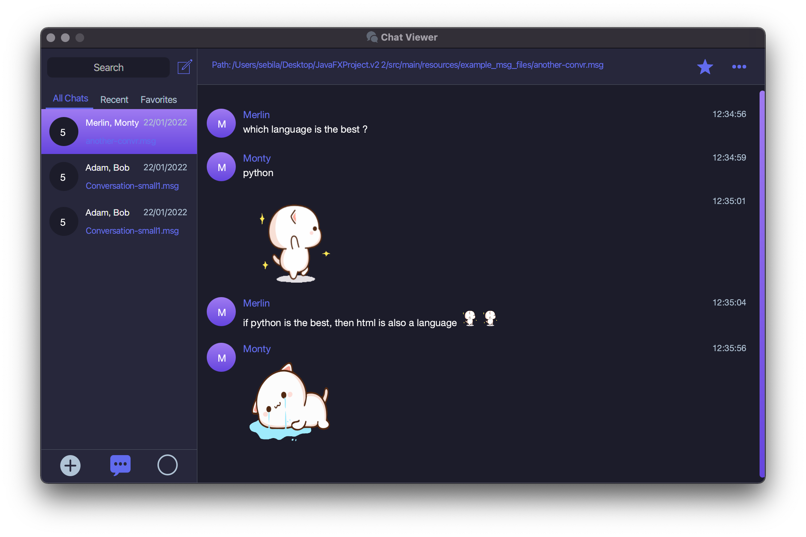
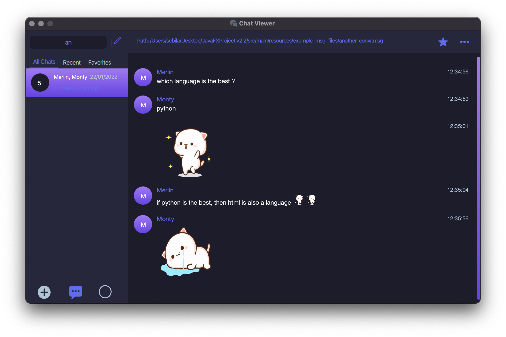
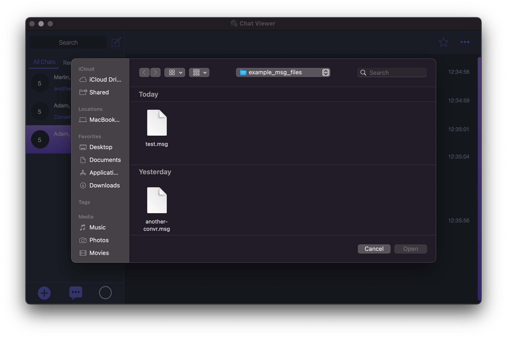
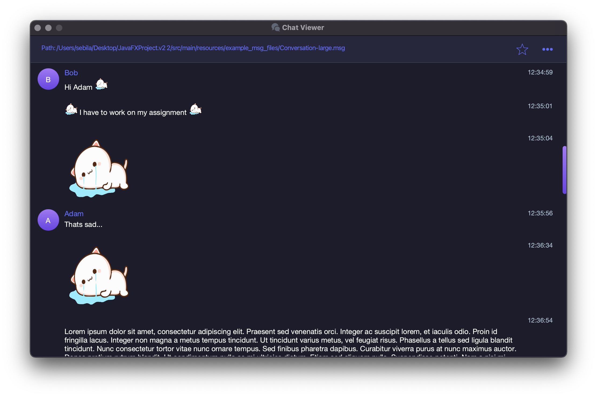
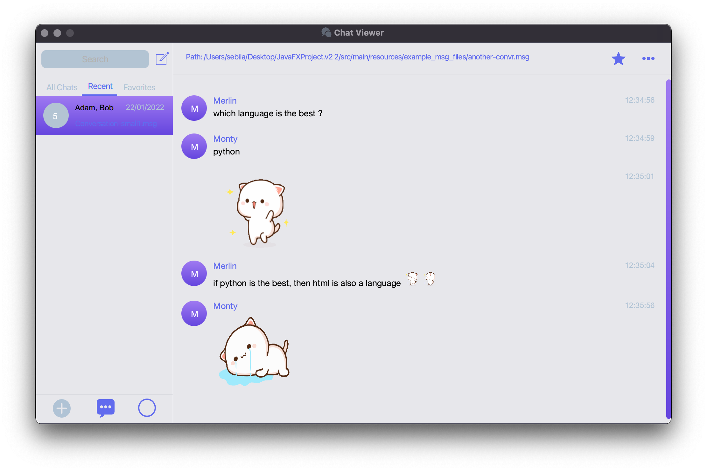

# JavaFX Chat Viewer #

This project is written using JavaFX in the context of the academic project of the university.
Hope you enjoy it as much as I enjoyed writing it :)

**Note:** there are still some gaps and potential improvements (this is my first JavaFX project), 
which I will continue later but all the required conditions were met.